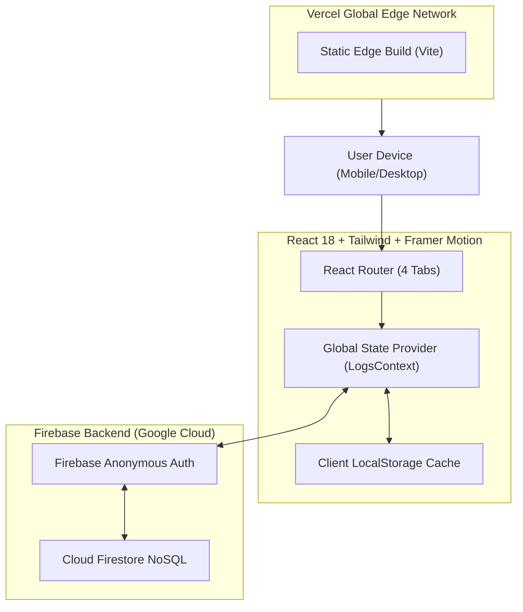

# PlastiTrack — System Architecture (Architecture.md)

---

## 1. High-Level System Architecture

PlastiTrack utilizes a modern **Jamstack Architecture** with an **Offline-First Hybrid Persistence Model**.



---

## 2. Component Hierarchy & Navigation Tree

```text
src/
├── App.jsx                     // App Wrapper, Background Mesh, Bottom Nav
├── main.jsx                    // React DOM Entrypoint
├── index.css                   // Tailwind Base & Glassmorphism Utilities
│
├── context/
│   └── LogsContext.jsx         // Global State: Firebase Sync + LocalStorage Fallback
│
├── pages/
│   ├── Dashboard.jsx           // Screen 1: Facts, Live Counters, Quick Actions
│   ├── LogEntry.jsx            // Screen 2: 1-Tap Category Grid & Steppers
│   ├── Alternatives.jsx        // Screen 3: 3D Swipeable Flip-Card Catalog
│   └── WeeklyInsights.jsx      // Screen 4: Recharts 7-Day Graph & Worst-Category Alert
│
├── components/
│   ├── Navbar.jsx              // Floating Glass Bottom Navigation
│   ├── GlassCard.jsx           // Reusable Frosted Glass Container with Framer Springs
│   ├── StatCounter.jsx         // Animated Count-Up Numeric Display
│   ├── WeeklyBarChart.jsx      // Recharts Custom Styled Bar Graph
│   ├── FactCard.jsx            // Daily Rotating Researched Fact
│   └── AlternativeFlipCard.jsx // 3D Perspective Flip Card (Framer Motion)
│
└── lib/
    ├── firebase.js             // Firebase App, Auth, and Firestore Initialization
    ├── plasticData.js          // Standardized Gram Weights & Cost Lookups
    ├── factsDatabase.js        // Curated 50-Fact Academic Research Dossier
    └── alternativesData.js     // Sustainable Swaps & Impact Calculation Engine
```

---

## 3. Data Flow & State Management

### 3.1 Dual-Layer Persistence Strategy (Offline-First)
To prevent any demo failure in front of faculty or without WiFi:
1. **Layer 1 (Instant LocalStorage)**: When a user taps an item, it writes directly to `localStorage` immediately. The UI updates in **0 milliseconds**.
2. **Layer 2 (Firebase Firestore Async Sync)**: Asynchronously saves the record to Firestore under the user's anonymous UID. If offline, changes queue locally and push once reconnected.

### 3.2 Firebase Firestore Schema
**Collection**: `plasticLogs`
```json
{
  "_id": "auto_generated_doc_id",
  "userId": "firebase_anonymous_uid_string",
  "category": "Bottle",
  "quantity": 1,
  "grams": 25,
  "costINR": 20,
  "timestamp": "2026-09-06T14:30:00Z"
}
```

---

## 4. Firestore Security Rules

```javascript
rules_version = '2';
service cloud.firestore {
  match /databases/{database}/documents {
    match /plasticLogs/{logId} {
      // Users can only read and write their own logs
      allow read, write: if request.auth != null && request.auth.uid == resource.data.userId;
      allow create: if request.auth != null && request.auth.uid == request.resource.data.userId;
    }
  }
}
```
