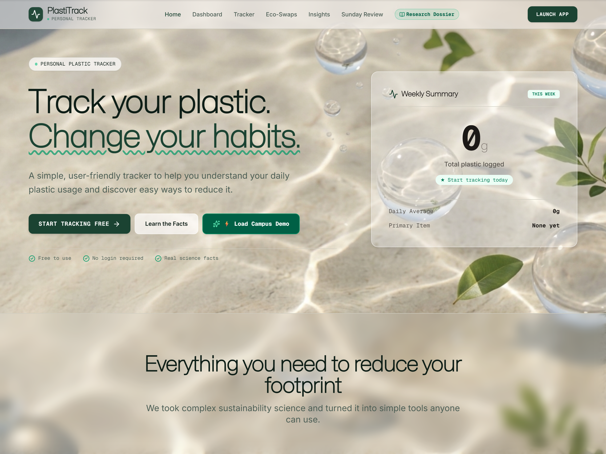
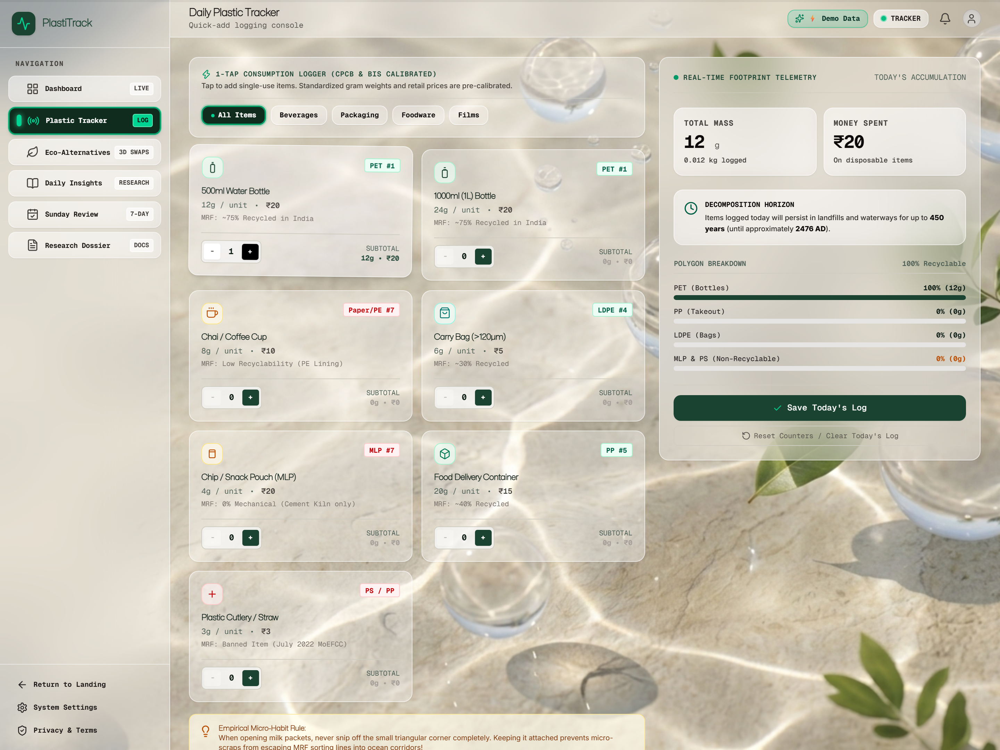
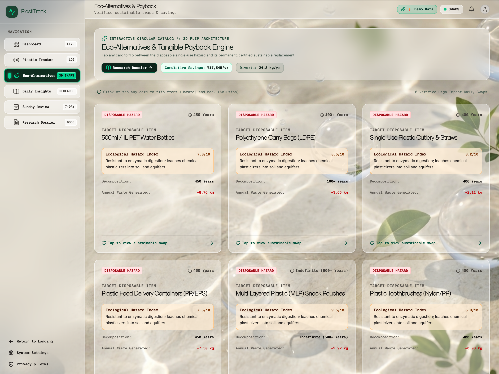

# PlastiTrack 🌿

> **Environmental Observability & Plastic Waste Habit Transformation Platform**  
> Benchmarked against Indian Central Pollution Control Board (CPCB) standards and IPCC carbon modeling.  
> Developed for **CHE110 — Environmental Studies (CA1 Group Project | Topic 13: Plastic Usage Tracker)**.

[](https://plastitrack.dushyantsinghbhati.me/)
[](https://opensource.org/licenses/MIT)
[](https://reactjs.org/)
[](https://vitejs.dev/)
[](https://tailwindcss.com/)

---

## 🌐 Live Deployment
- **Official URL:** [https://plastitrack.dushyantsinghbhati.me/](https://plastitrack.dushyantsinghbhati.me/)
- **Academic Research Dossier:** [https://plastitrack.dushyantsinghbhati.me/docs](https://plastitrack.dushyantsinghbhati.me/docs)
- **Primary Hosting:** Vercel Global Edge Network with custom DNS SSL configuration.

---

## 📸 Application Previews

| **Landing & Hero View** | **1-Tap Habit Tracker** |
| :---: | :---: |
|  |  |

| **Interactive 3D Eco-Swaps Catalog** |
| :---: |
|  |

---

## 👥 Academic Course Project Attribution
* **Course:** CHE110 – Environmental Studies (CA1 Evaluation)
* **Assigned Topic:** Topic 13 — Plastic Usage Tracker
* **Section:** K4P26CG
* **Institution:** Lovely Professional University (LPU), Punjab, India

### Project Team Members:
| Member Name | Registration Number | Roll Number | Primary Responsibility |
| :--- | :---: | :---: | :--- |
| **Dushyant Singh Bhati** | 12619023 | RK4P26CGB40 | **Technical Lead & System Architecture** |
| **Ansh Garg** | 12618762 | RK4P26CGB39 | **UI/UX & Design Systems Lead** |
| **Ranbir Sinha** | 12618592 | RK4P26CGB38 | **Content, Environmental QA & Research Lead** |

---

## 🔬 Scientific Methodology & Environmental Benchmarks

PlastiTrack is built on empirical environmental telemetry rather than abstract guessing:

1. **CPCB Urban Benchmark (33g/day):**  
   India's Central Pollution Control Board estimates average urban per capita plastic consumption at ~33 grams/day (~12 kg/year). PlastiTrack measures real-time variance against this limit.
2. **IPCC Carbon Factor (2.50 kg CO₂e / kg virgin polymer):**  
   Calculates embodied cradle-to-gate greenhouse gas emissions resulting from monomer extraction, polymerization, and transport.
3. **Statutory Alignment (MoEFCC PWM Rules & DPDP Act 2023):**  
   Aligned with India's ban on 19 identified single-use plastic categories (July 2022 amendment) and 100% compliant with local DPDP client-side storage principles.
4. **Polymer Degradation Kinetics:**  
   Simulates decomposition lifespans across polymer matrices (PET: ~450 yrs, HDPE: ~100 yrs, LDPE: ~50 yrs, PS: ~500 yrs).

---

## ✨ Key Features & Architecture

```
┌────────────────────────────────────────────────────────────────────────┐
│                              PLASTITRACK                               │
├─────────────────┬──────────────────┬─────────────────┬─────────────────┤
│ 1. DASHBOARD    │ 2. DAILY TRACKER │ 3. ECO-CATALOG  │ 4. RESEARCH     │
│ • Daily Fact    │ • 1-Tap Logging  │ • 3D Flip Cards │ • CPCB Datasets │
│ • Today's Grams │ • Category Grid  │ • Cost Savings  │ • DPDP Privacy  │
│ • CO₂e Footprint│ • Quick Stepper  │ • Habit Swaps   │ • Decomposition │
└─────────────────┴──────────────────┴─────────────────┴─────────────────┘
```

* **⚡ Zero-Friction 1-Tap Logging:** Log bottles, carry bags, wrappers, cutlery, and delivery boxes in seconds without manual typing.
* **📊 7-Day Sunday Review:** Weekly summary calculating weekly grams, daily average, and identifying the primary waste stream.
* **🔄 Interactive 3D Eco-Swaps:** Flip cards showing single-use polymers on the front and sustainable zero-waste alternatives (with annual ₹ and plastic savings) on the back.
* **🧪 Academic Research Dossier (`/docs`):** In-depth documentation with cited formulas, statutory policies, and degradation timelines.
* **📱 Progressive Web App (PWA):** Installable on iOS Safari, Android Chrome, and Desktop with offline capability and custom app icons.

---

## 🚀 Local Development Setup

### Prerequisites
- Node.js (v18 or higher)
- npm or pnpm

### Quick Start
```bash
# 1. Clone the repository
git clone https://github.com/DushyantSingh7120/PlastiTrack.git

# 2. Navigate to project directory
cd PlastiTrack

# 3. Install dependencies
npm install

# 4. Start local development server
npm run dev
```

### Production Build
```bash
npm run build
npm run preview
```

---

## 📄 License
This project is licensed under the **MIT License** — free for academic, non-commercial, and open-source environmental education.
